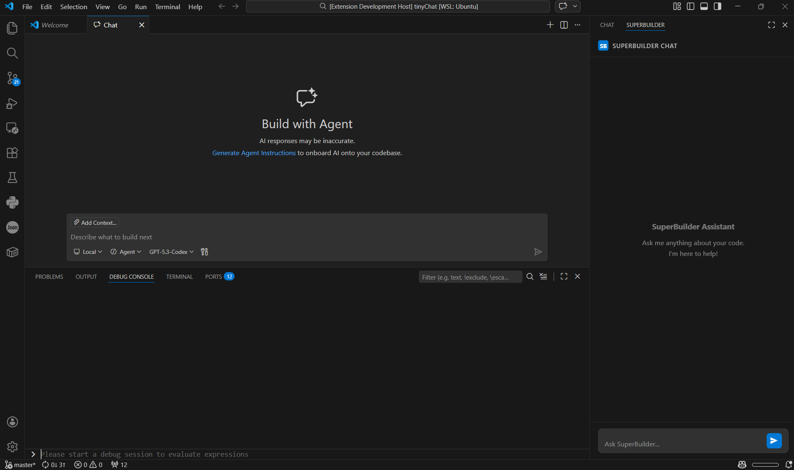

# Supercode - Local Coding Assistant

AI-powered coding assistant for VS Code with Intel Super Builder integration.



## Quick Start

1. **Install dependencies:**
   ```bash
   npm install
   ```

2. **Compile TypeScript:**
   ```bash
   npm run compile
   ```

3. **Start your backend** (in another terminal):
   ```bash
   cd ../backend
   python main.py
   ```

4. **Test the extension:**
   - Press **F5** to launch Extension Development Host
   - Press **Ctrl+Alt+I** to open chat
   - Type: `@superbuilder hello!`

## Documentation

See [DEVELOPMENT.md](DEVELOPMENT.md) for complete setup guide, troubleshooting, and development workflow.

## Features

- 💬 **Chat Interface**: Talk to AI directly in VS Code
- 🔄 **Real-time Streaming**: Get instant responses
- 🔌 **Backend Integration**: Connects to your local FastAPI server
- 📊 **Health Monitoring**: Check system status anytime

## Requirements

- VS Code 1.85+
- Node.js 18+
- Backend running on http://localhost:8003

---

For detailed instructions, see [DEVELOPMENT.md](DEVELOPMENT.md)

